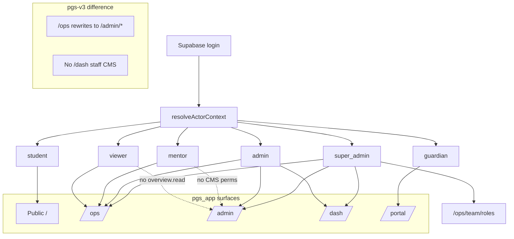
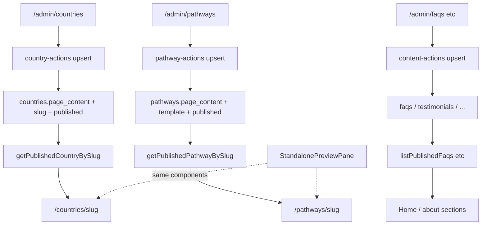

# Phase 1 plan — pgs_app vs pgs-v3

Use this doc **before implementing** Phase 1 (permissions, admin flows, mentor/viewer, CMS linking).

> **Why chat links did not open:** Cursor chat does not reliably open `http://localhost:...` or bare `src/...` paths.  
> **This file lives in your repo** — `Cmd+Click` (Mac) / `Ctrl+Click` (Windows) on paths below jumps to source.  
> For live pages, copy URLs from the [Local URLs](#local-urls-copy-into-browser) section into your browser while `npm run dev` is running.

---

## Local URLs (copy into browser)

| Screen | URL |
|--------|-----|
| Public home | `http://localhost:3000/` |
| Ops scoreboard | `http://localhost:3000/ops` |
| Ops students | `http://localhost:3000/ops/students` |
| Permission matrix (Super Admin) | `http://localhost:3000/ops/team/roles` |
| Team directory | `http://localhost:3000/ops/team` |
| Admin CMS home | `http://localhost:3000/admin` |
| Country editor + preview | `http://localhost:3000/admin/countries` |
| Pathway editor + preview | `http://localhost:3000/admin/pathways` |
| Public country page | `http://localhost:3000/countries/usa` |
| Public pathway page | `http://localhost:3000/pathways/usmle` |
| Staff dash CMS | `http://localhost:3000/dash` |
| Student profile | `http://localhost:3000/userprofile` |
| Guardian portal | `http://localhost:3000/portal` |

---

## pgs_app vs pgs-v3 — permission & admin

| Topic | **pgs_app (current)** | **pgs-v3** | Phase 1 decision |
|-------|----------------------|------------|------------------|
| **Ops URL** | First-class [`/ops`](../src/app/ops/layout.tsx) | `/ops` rewrites to `/admin/*` (see `E:\pgs2\pgs-v3\next.config.ts`) | **Keep pgs_app** — clearer product split |
| **Admin CMS URL** | [`/admin`](../src/app/admin/layout.tsx) purple sidebar | Same path, shared `AdminShell` for ops + cms (`pgs-v3\src\components\admin-shell.tsx`) | **Keep pgs_app** AdminShell (ThemeZaa-adjacent admin CSS) |
| **Dash CMS** | [`/dash`](../src/app/dash/layout.tsx) premium student dashboard CMS | **No equivalent** — student uses `/dashboard` | **Keep pgs_app** — unique win |
| **Staff roles** | `super_admin`, `admin`, `mentor`, `viewer`, `guardian`, `student` | `super_admin`, `admin`, `mentor`, `read_only_staff` only | **Keep pgs_app** names; map `viewer` ↔ v3 `read_only_staff` in DB |
| **Viewer / read-only** | Viewer staff: workspace read + docs + notifications ([defaults](../src/lib/operations/role-matrix.ts)) | `read_only_staff`: **`overview.read` + `students.read`** only — directory, not workspace (`pgs-v3\src\lib\operations-staff-access.ts`) | **Important diff** — decide in Phase 1 (see below) |
| **Permission matrix UI** | [`/ops/team/roles`](../src/app/ops/team/roles/page.tsx) + [`RoleMatrixEditor`](../src/features/operations/components/RoleMatrixEditor.tsx) | **None** — DB seed only | **Keep pgs_app** |
| **Staff context** | [`resolveActorContext`](../src/lib/auth/actor-context.ts) via `staff_profiles.role_key` | `buildStaffContext` via `staff_role_assignments` (`pgs-v3\src\lib\staff-auth.ts`) | **Adopt v3 pattern** in Phase 2; Phase 1 align behavior only |
| **Student access** | [`canViewStudent`](../src/lib/auth/student-access.ts) — no reason codes | v3 `student-access.ts` — reason codes + audit on deny | **Adopt v3 reason codes** in Phase 2 |
| **Ops nav permission keys** | Granular: Students need `students.read` OR workspace read ([nav](../src/features/operations/nav.ts)) | Coarse: Students + Targets need **`overview.read`** only (`pgs-v3\src\components\admin-shell.tsx`) | **Keep pgs_app** granular nav |
| **Admin gate** | `overview.read` required ([layout](../src/app/admin/layout.tsx)) | Per-route: `content.read`, `catalog.read`, etc. | **Keep pgs_app** simple gate for Phase 1 |
| **Mentor ops nav** | Hide Team + Activity when `roleKey === mentor` | Hide Team + Activity on **mentor preview** only | **Align pgs_app** — also hide on real mentor role (already done in nav) |
| **Preview-as-student/mentor** | [`staff-preview-server`](../src/lib/operations/staff-preview-server.ts) | v3 preview + **blocks mutating APIs** in proxy | **Adopt v3** API read-only preview in Phase 2 |
| **Tests** | Placeholder [pgTAP](../supabase/tests/030_operations_access.sql), no TS tests | 50+ unit tests + Playwright ops specs | **Adopt v3** harness in Phase 2 |
| **Audit** | Some RPC audit events | Full `audit.ts` deny/success taxonomy in v3 | Phase 2 |

### Viewer role — biggest behavioral difference

| | **pgs_app Viewer** | **v3 read_only_staff** |
|--|-------------------|------------------------|
| Can enter `/ops`? | Yes (`student_workspace.read`) | Yes (`overview.read`) |
| Ops nav | Students + Notifications | Scoreboard + Students + Targets + Notifications (if grants present) |
| Student registry | Assigned/linked workspace scope | **Directory read** (`students.read`) — org filters if granted |
| Open premium workspace? | If assigned + premium | **Typically no** — no workspace permissions in default bag |
| Admin CMS | Blocked (no `overview.read`) | Can open `/admin/content` if given `content.read` |

**Phase 1 recommendation:** Keep pgs_app Viewer as **“assigned/linked student visibility”** (counselor-lite), not v3’s directory-only read_only_staff. Document this explicitly so Super Admin knows what Viewer means.

### Mentor role — largely aligned

| Surface | Both |
|---------|------|
| Registry | Assigned students only (`isMentorScopedRegistry`) |
| Scoreboard | Assigned-student scope |
| Targets | Own work + manage own targets |
| Team / Activity | Hidden for mentor |
| CMS | No default CMS permissions |
| Premium assign | Needs `premium.manage` → [`/ops/access`](../src/app/ops/access/page.tsx) |

---

## pgs_app vs pgs-v3 — CMS & page linking

| Topic | **pgs_app** | **pgs-v3** | Phase 1 decision |
|-------|-------------|------------|------------------|
| **CMS architecture** | [`content-registry.ts`](../src/features/admin/content-registry.ts) + per-route admin pages | `admin-registry.ts` + `/admin/catalog/[entity]` + `/admin/content/modules/[module]` in v3 | **Keep pgs_app** page-per-feature admin |
| **Country pages** | [`CountryCmsTable`](../src/features/admin/CountryCmsTable.tsx) — visual editor + **live preview pane** | Countries in catalog registry — **lookup only**; editorial pages in **CMS page slots** (`/admin/content/pages`) | **Keep pgs_app** — this is the “beautiful” pattern |
| **Pathway pages** | [`PathwayCmsTable`](../src/features/admin/PathwayCmsTable.tsx) + preview | CMS page slots in code, not visual pathway editor | **Keep pgs_app** |
| **Courses / events** | [`CatalogCmsTable`](../src/features/admin/CatalogCmsTable.tsx) + visual editors | Generic catalog entity CRUD | **Keep pgs_app** rich editors |
| **Public read layer** | [`cms-public.ts`](../src/lib/catalog/cms-public.ts) + [`public.ts`](../src/lib/catalog/public.ts) | `public-catalog.ts` + content publish overlay in v3 | Same idea; pgs_app already wired |
| **Publish contract** | `published = true`; catalog also `lifecycle_phase = live` | Draft / preview / publish revisions for CMS pages | pgs_app simpler; v3 stronger for legal/docs revisioning |
| **Preview in admin** | [`StandalonePreviewPane`](../src/features/admin/StandalonePreviewPane.tsx) renders real public components | Separate preview API routes for CMS pages | **Keep pgs_app** inline preview |
| **Slug → public URL** | [`countries/[slug]`](../src/app/(public)/countries/[slug]/page.tsx), [`pathways/[slug]`](../src/app/(public)/pathways/[slug]/page.tsx) | Legacy country routes + CMS-driven slots | **Keep pgs_app** slug routing |

**Do not replace** pgs_app CMS with v3’s module grid in Phase 1. v3 is stronger on **revision/publish pipeline** for legal pages — port that later if needed.

---

## What Phase 1 implements (no v3 rewrite)

1. **Document** role → surface map (this file + matrix defaults match nav).
2. **Fix alignment gaps** where pgs_app diverges from intended behavior (not v3’s read_only_staff semantics unless you choose to).
3. **Preserve** Country/Pathway/Catalog CMS + `StandalonePreviewPane` as the standard.
4. **Do not** merge `/ops` into `/admin` or remove `/dash`.

### Phase 1 — from pgs_app only

- Permission matrix UI and Super Admin role governance
- `/ops` + `/admin` + `/dash` + `/portal` four surfaces
- Visual country/pathway editors with live preview
- Viewer / Guardian / Student product roles in matrix

### Phase 1 — study v3, implement later (Phase 2)

- `staff-auth.ts` + assignment-based context
- Student access reason codes + deny audit
- Preview mode blocks POST APIs
- Playwright role fixtures + pgTAP real assertions
- Rate limiting / server-security helpers

---

## Screen map with source links

### 1. Public frontend

| What you see | Source |
|--------------|--------|
| Home (Guest / Student / Premium) | [`src/app/(public)/page.tsx`](../src/app/(public)/page.tsx) → [`HomePage`](../src/features/home/HomePage.tsx) |
| Experience switcher | [`src/lib/auth/experience.tsx`](../src/lib/auth/experience.tsx) |
| Country public page | [`src/app/(public)/countries/[slug]/page.tsx`](../src/app/(public)/countries/[slug]/page.tsx) |
| Pathway public page | [`src/app/(public)/pathways/[slug]/page.tsx`](../src/app/(public)/pathways/[slug]/page.tsx) |
| CMS readers | [`src/lib/catalog/cms-public.ts`](../src/lib/catalog/cms-public.ts) |

### 2. Ops (dark shell `#0f0b18`)

| What you see | Source |
|--------------|--------|
| Layout + gates | [`src/app/ops/layout.tsx`](../src/app/ops/layout.tsx) |
| Shell + nav filter | [`src/features/operations/OpsShell.tsx`](../src/features/operations/OpsShell.tsx), [`nav.ts`](../src/features/operations/nav.ts) |
| Styles | [`src/features/operations/operations.css`](../src/features/operations/operations.css) |
| Permission matrix | [`src/app/ops/team/roles/page.tsx`](../src/app/ops/team/roles/page.tsx) |
| Staff access panel | [`src/features/operations/components/StaffAccessDetail.tsx`](../src/features/operations/components/StaffAccessDetail.tsx) |
| Defaults | [`src/lib/operations/role-matrix.ts`](../src/lib/operations/role-matrix.ts) |

### 3. Admin CMS (light shell `#2a1848`)

| What you see | Source |
|--------------|--------|
| Layout gate (`overview.read`) | [`src/app/admin/layout.tsx`](../src/app/admin/layout.tsx) |
| Sidebar nav | [`src/features/admin/nav.ts`](../src/features/admin/nav.ts), [`AdminShell.tsx`](../src/features/admin/AdminShell.tsx) |
| Generic content CRUD | [`ContentCmsTable.tsx`](../src/features/admin/ContentCmsTable.tsx) + [`content-registry.ts`](../src/features/admin/content-registry.ts) |
| Country editor + preview | [`CountryCmsTable.tsx`](../src/features/admin/CountryCmsTable.tsx) |
| Pathway editor + preview | [`PathwayCmsTable.tsx`](../src/features/admin/PathwayCmsTable.tsx) |
| Live preview component | [`StandalonePreviewPane.tsx`](../src/features/admin/StandalonePreviewPane.tsx) |

### 4. Student profile & dash CMS

| What you see | Source |
|--------------|--------|
| `/userprofile` | [`src/app/(public)/userprofile/page.tsx`](../src/app/(public)/userprofile/page.tsx) |
| `/dash` staff list | [`src/app/dash/page.tsx`](../src/app/dash/page.tsx) |
| `/dash/[studentId]` editor | [`src/app/dash/[studentId]/page.tsx`](../src/app/dash/[studentId]/page.tsx) |
| Access gate | [`src/lib/auth/student-access.ts`](../src/lib/auth/student-access.ts) |

---

## Mermaid — full build flow

### Permission & surfaces



### CMS publish → public link (pgs_app)



### Student profile operation

```mermaid
%%{init: {"flowchart": {"useMaxWidth": true}}}%%
flowchart TD
  Signup[Auth signup] --> Prof[profiles row]
  Prof --> PE[premium_entitlements]
  PE --> RPC[student_has_active_premium]

  RPC --> UP[/userprofile]
  RPC --> DB[/dashboard premium UI]

  Staff[/ops/students/id] --> CV[canViewStudent]
  CV --> WS[premium workspace]
  Staff2[/dash/studentId] --> CV2[requireStudentViewer manage]
  CV2 --> PWP[premium_workspace_profiles]
  PWP --> UP
```

---

## v3 reference paths (read-only, sibling repo)

| Area | Path |
|------|------|
| v3 repo root | `E:\pgs2\pgs-v3` |
| Ops shell | `E:\pgs2\pgs-v3\src\components\admin-shell.tsx` |
| Staff auth | `E:\pgs2\pgs-v3\src\lib\staff-auth.ts` |
| Student access | `E:\pgs2\pgs-v3\src\lib\student-access.ts` |
| Admin registry | `E:\pgs2\pgs-v3\src\lib\admin-registry.ts` |
| Ops e2e tests | `E:\pgs2\pgs-v3\tests\e2e\admin-operations.spec.ts` |
| SQL RBAC | `E:\pgs2\pgs-v3\supabase\migrations\20260814140833_phase4a_actor_context_rbac.sql` |

---

## Pre-implementation checklist

- [ ] Open this file in the IDE and click through source links above
- [ ] Copy localhost URLs into browser with dev server running
- [ ] Confirm Super Admin can open `/ops/team/roles`
- [ ] Confirm Viewer cannot open `/admin` (redirect)
- [ ] Side-by-side: edit country in admin, view `/countries/{slug}`
- [ ] Decide Viewer semantics: pgs_app (workspace) vs v3 (directory-only)
- [ ] Only then start Phase 1 code changes
